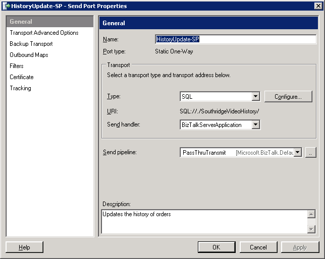
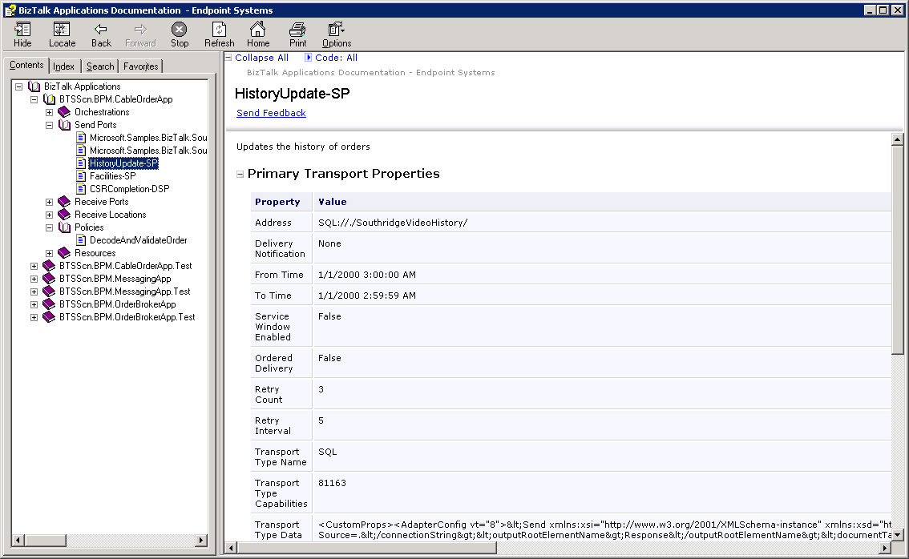
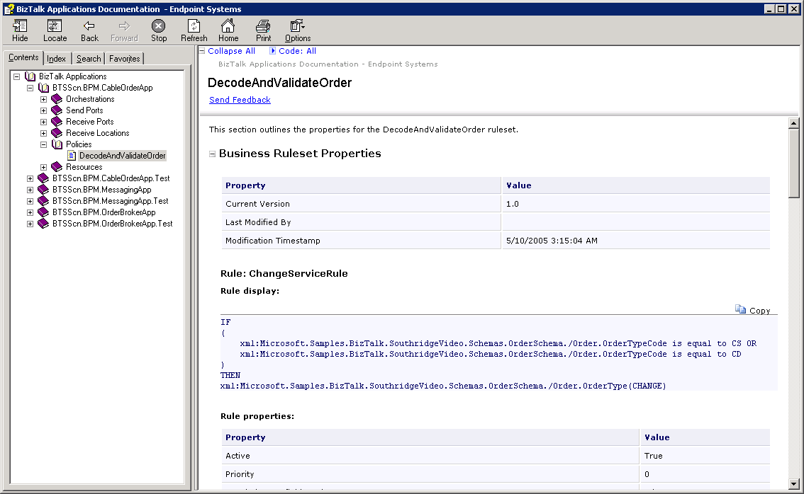

# ShoBiz

**Project Description**
BizTalk tool that generates Sandcastle documentation from BizTalk artifacts deployed into the databases. Promotes documentation as part of the solution lifecycle. Documentation structure mimics the Admin Console and extracts documentation comments from all sources. 

# Introduction
The purpose of this project is to have a tool that:
* Helps BizTalk developers create comprehensive better documentation for their solutions
* Promote better artifact documentation by extracting comments and notes from the BizTalk artifacts themselves and making it a part of the documentation
* Create a strong _starting point_ for solution documentation

# Software Prerequisites
This project generates a [Sandcastle Help File Builder](http://shfb.codeplex.com) project, which in turn uses [Sandcastle](http://sandcastle.codeplex.com) to build CHM, Visual Studio and web-based help output. You need both of these projects installed (plus [Sandcastle Styles](http://sandcastlestyles.codeplex.com/)) in order to generate any meaningful output.

This project also need to run on a machine with BizTalk installed. 

# Example
The following demonstrates documenting the BPM Solution Scenario from the BizTalk SDK Samples. 

[Download zipped CHM](Home_documentation.zip)

The following is a screenshot of comments found in the BizTalk Administration Console:

You can observe these comments in the documentation here:

Here's a screenshot of what the BRE rules look like:

Enjoy!
